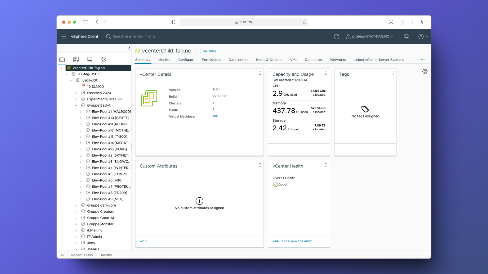
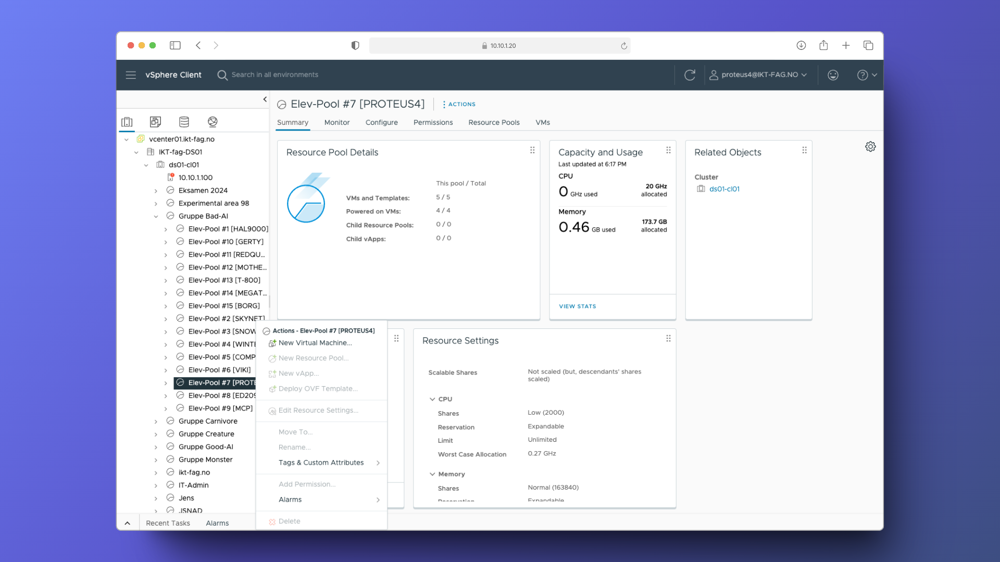

# Hvordan opprette VM

## Velkommen til VCENTER

<figure><figcaption>
Dette er dashboardet til VCENTER
</figcaption></figure>

<figure><figcaption></figcaption></figure>

Gå så til din elev pool og right-click den. Etter dette trykker du "New viritual machine"

### New viritual machine



<figure><figcaption></figcaption></figure>



<figure><figcaption></figcaption></figure>



<figure><figcaption></figcaption></figure>



<figure><figcaption></figcaption></figure>



<figure><figcaption></figcaption></figure>



<figure><figcaption></figcaption></figure>


